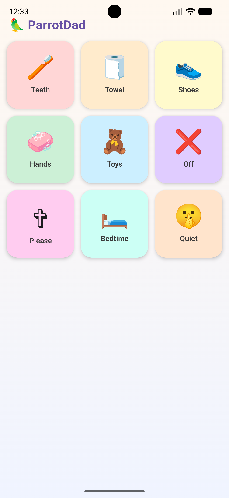

# 🦜 ParrotDad

A tiny, polished Android app for parents to quickly play short reminder messages for kids using a playful emoji soundboard.

<p align="center">
  
</p>

## Features

- 3×3 grid of emoji soundboard buttons
- Pastel-colored, playful Material 3 UI
- Bounce animation on button press + startup bounce
- Haptic feedback on tap
- One sound plays at a time — tapping a new button stops the previous sound
- Audio stops and resources are released when the app backgrounds
- Fully offline, no permissions required (beyond system audio)
- Portrait-only, responsive layout

## Tech Stack

| Layer        | Technology                           |
|--------------|--------------------------------------|
| Language     | Kotlin                               |
| UI           | Jetpack Compose + Material 3         |
| Audio        | Android MediaPlayer (res/raw)        |
| Architecture | Single Activity, no ViewModel needed |
| Build        | Gradle Kotlin DSL                    |
| Min SDK      | 26 (Android 8)                       |
| Target SDK   | 35                                   |

## Project Structure

```
app/src/main/
├── java/com/parrotdad/soundboard/
│   ├── MainActivity.kt              # Single Activity entry point
│   ├── audio/
│   │   └── SoundPlayer.kt           # Lifecycle-safe MediaPlayer wrapper
│   ├── data/
│   │   ├── SoundItem.kt             # Data model
│   │   └── SoundboardData.kt        # Static list of 9 sound items
│   └── ui/
│       ├── SoundboardScreen.kt      # Main screen composable
│       ├── SoundButton.kt           # Individual animated button
│       └── theme/
│           ├── Color.kt
│           ├── Theme.kt
│           └── Type.kt
└── res/
    └── raw/                         # Audio files go here
        ├── sound_teeth.mp3
        ├── sound_towel.mp3
        └── ...
```

## Adding Real Audio

Replace the placeholder files in `app/src/main/res/raw/` with real MP3/OGG recordings:

| File                | Content                      |
|---------------------|------------------------------|
| `sound_teeth.mp3`   | "Please go brush your teeth" |
| `sound_towel.mp3`   | "Use the paper towel"        |
| `sound_shoes.mp3`   | "Please put on your shoes"   |
| `sound_hands.mp3`   | "Go wash your hands"         |
| `sound_toys.mp3`    | "Time to pick up your toys"  |
| `sound_dishes.mp3`  | "Please clear your dishes"   |
| `sound_clothes.mp3` | "Time to get dressed"        |
| `sound_bedtime.mp3` | "Time for bed!"              |
| `sound_quiet.mp3`   | "Shhh, quiet please"         |

## Building

Open the project in Android Studio (Hedgehog or newer) and click **Run**.

Or from the command line:
```bash
./gradlew assembleDebug
```
